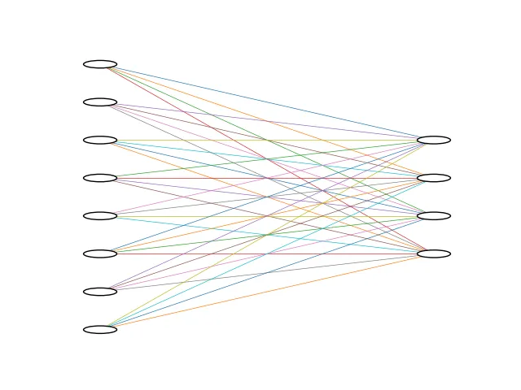

+++
date = '2025-08-12T11:49:00+03:30'
draft = false
title = 'Introduction'
description = "Introduction to PyTorch"
weight = 10
tags = ["PyTorch", "Deep-Learning", "Python"]
image = "introduction.webp"
+++

# Introduction

## What is PyTorch

**PyTorch** is an open-source framework for **Machine Learning**.
It is developed by **Facebook AI Research** ( **Meta** ).
This framework is mostly used to build and train **Deep Learning** models.
Because of its flexibility and **Pythonic inference**, it has become so popular,
especially among researchers.
So, let's write a **hello world** to understand **PyTorch** better.
Then, in the future, we will complete this **hello world** example step by step.

Code of this tutorial is available at:
[link to code](https://github.com/LiterallyTheOne/Pytorch_Tutorial/blob/main/src/0_hello_world.ipynb)

## Hello world

### Problem definition

Imagine that we have `3` samples of data.
Each sample has `8` features.
We want to classify this data into `4` classes.
So, the shape of our data would be `[3, 8]` and the shape of our result should be `[3, 4]`.
Now, our plan is to just make a model that we can feed our data to.
The simplest way to do that is to have a **fully connected layer**, with the input size of `8`
and the output size of `4`, like the image below:



### Implementation

At first, we should import the necessary modules as below:

```python
# -------------------[ Imports ]-------------------
import torch
from torch import nn
```

In the code above, we import `torch` and `nn` (neural network).
Now, let's create random data:

```python
# -------------------[ Data ]-------------------
data = torch.rand((3, 8))  # (number_of_samples, features)
```

Now, we have random data that has 3 samples, and each sample has `8` features.
After that, let's create a simple linear model like the image that we provided
in the implementation section.

```python
# -------------------[ Model ]-------------------
model = nn.Linear(8, 4)  # (features, number_of_classes)
```

The code above creates a fully connected neural network layer that
takes `8` features as its input and produces `4` classes as its output.
For the next step, let's feed that data to our model.

```python
# -------------------[ Feed the data to the model ]-------------------
logits = model(data)
print(logits)

"""
--------
output: 

tensor([[ 5.3127e-01,  6.7324e-01, -1.7548e-01, -2.0279e-02],
       [ 5.3984e-01,  1.0462e+00, -1.0124e-01,  8.4969e-03],
       [ 4.6493e-01,  1.0864e+00, -3.6424e-01,  8.6406e-04]],
      grad_fn=<AddmmBackward0>)
"""

```

As you can see, we could simply call the model with our data.
The output would be something like the probability of each class in
each sample.
As you might have noticed, there is a `grad_fn` in the output.
When we call the model like this, `PyTorch` stores the `gradient` that
we are going to use it in the future.
So, if we want to get the class that we want, we should just report the
index of the maximum probability.

```python
result = logits.argmax(1)
print(result)

"""
--------
output: 

tensor([1, 1, 1])
"""
```

In the code above, I took the `argmax` of the dimension `1`, which
had the probabilities on it.
Because we haven't trained our model yet, the results are biased and
all of them are predicting that this sample belongs to class `1`.

In further we are going to explain each of them and try to complete
our code step by step.
You must have so many questions right now, but don't worry, they
will be answered soon.


