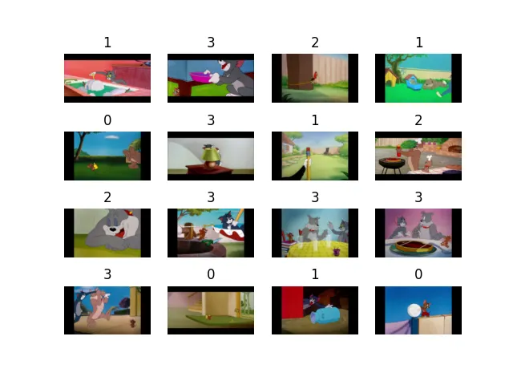

+++
date = '2025-09-01T09:24:00+03:30'
draft = false
title = "Fine-tuning"
description = "Explain about how to use transfer learning and how to fine-tune a model"
weight = 110
tags = ["PyTorch", "TorchVision", "Deep-Learning", "Python", "Kaggle"]
image = "fine-tuning.webp"
code = "https://github.com/LiterallyTheOne/Pytorch_Tutorial/blob/main/src/10_fine_tuning"
+++

# Fine-tuning

## Introduction

**Fine-tuning** is one of the most used techniques in **deep learning**.
In this tutorial, we are going to learn how to load a pretrained model.
Then, how to do **Transfer learning**.
Finally, **Fine-tune** our model.

## Load a dataset from Kaggle

In previous tutorials, we learned how to load a dataset from
[Kaggle](https://www.kaggle.com/).
We have loaded a dataset called **Tom and Jerry image classification** and made the three subsets of **train**,
**validation**, and **test**.
Now, let's do it again.

```python
path = kagglehub.dataset_download("balabaskar/tom-and-jerry-image-classification")
path = Path(path) / "tom_and_jerry/tom_and_jerry"

tom_and_jerry_transforms = transforms.Compose([transforms.Resize([90, 160]), transforms.ToTensor()])

all_data = ImageFolder(path, transform=tom_and_jerry_transforms)

g1 = torch.Generator().manual_seed(20)
train_data, val_data, test_data = random_split(all_data, [0.7, 0.2, 0.1], g1)

train_loader = DataLoader(train_data, batch_size=16, shuffle=True)
val_loader = DataLoader(val_data, batch_size=16, shuffle=False)
test_loader = DataLoader(test_data, batch_size=16, shuffle=False)
```

Let's plot on batch of its data:

```python
images, labels = next(iter(train_loader))

fig, axes = plt.subplots(4, 4)

axes_ravel = axes.ravel()

for i, (image, label) in enumerate(zip(images, labels)):
    axes_ravel[i].imshow(transforms.ToPILImage()(image))
    axes_ravel[i].set_title(label.item())
    axes_ravel[i].set_axis_off()
```



## Load a pretrained model
