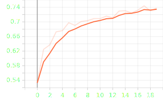

+++
date = '2025-09-01T09:24:00+03:30'
draft = false
title = "Fine-tuning"
description = "Explain about how to use transfer learning and how to fine-tune a model"
weight = 110
tags = ["PyTorch", "TorchVision", "Deep-Learning", "Python", "Kaggle", "Tensorboard"]
image = "fine-tuning.webp"
code = "https://github.com/LiterallyTheOne/Pytorch_Tutorial/blob/main/src/10_fine_tuning"
+++

# Fine-tuning

## Introduction

**Fine-tuning** is one of the most used techniques in **deep learning**.
In this tutorial, we are going to learn how to load a pretrained model.
Then, how to do **Transfer learning**.
Finally, **Fine-tune** our model.

## Load a dataset from Kaggle

In previous tutorials, we learned how to load a dataset from
[Kaggle](https://www.kaggle.com/).
We have loaded a dataset called **Tom and Jerry image classification** and made the three subsets of **train**,
**validation**, and **test**.
Now, let's do it again.

```python
path = kagglehub.dataset_download("balabaskar/tom-and-jerry-image-classification")
path = Path(path) / "tom_and_jerry/tom_and_jerry"

tom_and_jerry_transforms = transforms.Compose([transforms.Resize([90, 160]), transforms.ToTensor()])

all_data = ImageFolder(path, transform=tom_and_jerry_transforms)

g1 = torch.Generator().manual_seed(20)
train_data, val_data, test_data = random_split(all_data, [0.7, 0.2, 0.1], g1)

train_loader = DataLoader(train_data, batch_size=16, shuffle=True)
val_loader = DataLoader(val_data, batch_size=16, shuffle=False)
test_loader = DataLoader(test_data, batch_size=16, shuffle=False)
```

Let's plot on batch of its data:

```python
images, labels = next(iter(train_loader))

fig, axes = plt.subplots(4, 4)

axes_ravel = axes.ravel()

for i, (image, label) in enumerate(zip(images, labels)):
    axes_ravel[i].imshow(transforms.ToPILImage()(image))
    axes_ravel[i].set_title(label.item())
    axes_ravel[i].set_axis_off()
```


## Load a pretrained model

**TorchVision** has prepared some of the most famous vision models with pretrained weights.
In this tutorial, we are going to use a model called **MobileNetV2**.
To load that model, we can use the code below:

```python
from torchvision.models import mobilenet_v2, MobileNet_V2_Weights

model = mobilenet_v2(weights=MobileNet_V2_Weights.IMAGENET1K_V1)
print(model)

"""
--------
output: 

MobileNetV2(
  (features): Sequential(
    (0): Conv2dNormActivation(
      (0): Conv2d(3, 32, kernel_size=(3, 3), stride=(2, 2), padding=(1, 1), bias=False)
      (1): BatchNorm2d(32, eps=1e-05, momentum=0.1, affine=True, track_running_stats=True)
      (2): ReLU6(inplace=True)
    )
    ...
   (17): InvertedResidual(
      (conv): Sequential(
        (0): Conv2dNormActivation(
          (0): Conv2d(160, 960, kernel_size=(1, 1), stride=(1, 1), bias=False)
          (1): BatchNorm2d(960, eps=1e-05, momentum=0.1, affine=True, track_running_stats=True)
          (2): ReLU6(inplace=True)
        )
        (1): Conv2dNormActivation(
          (0): Conv2d(960, 960, kernel_size=(3, 3), stride=(1, 1), padding=(1, 1), groups=960, bias=False)
          (1): BatchNorm2d(960, eps=1e-05, momentum=0.1, affine=True, track_running_stats=True)
          (2): ReLU6(inplace=True)
        )
        (2): Conv2d(960, 320, kernel_size=(1, 1), stride=(1, 1), bias=False)
        (3): BatchNorm2d(320, eps=1e-05, momentum=0.1, affine=True, track_running_stats=True)
      )
    )
    (18): Conv2dNormActivation(
      (0): Conv2d(320, 1280, kernel_size=(1, 1), stride=(1, 1), bias=False)
      (1): BatchNorm2d(1280, eps=1e-05, momentum=0.1, affine=True, track_running_stats=True)
      (2): ReLU6(inplace=True)
    ) 
  )
  (classifier): Sequential(
    (0): Dropout(p=0.2, inplace=False)
    (1): Linear(in_features=1280, out_features=1000, bias=True)
  )
)

"""
```

In the code above, we have imported `mobilenet_v2` and `MobileNet_V2_Weights`.
Then we loaded the mobile net with the weights that are pretrained on a dataset called **ImageNet**.
Then, we printed the model to see the layers.
As you can see, it consists of 2 **Sequential layers**.
The first one is to extract features from the image.
The second one is for classification.

## Transfer Learning

Transfer learning is a technique of using a pretrained model (called the base model),
on a new dataset with a different purpose.
We don't train all the layers; instead, we only train the **classification layers**.
So, the first step is to freeze all the layers.

```python
# -------------------[ Freeze the model weights ]-------------------
for param in model.parameters():
    param.requires_grad = False
```

With the code above, we can freeze all the parameters.
Now, let's replace the **classification layer** with our layer.

```python
print("classifier before the change:")
print(model.classifier)
print("-" * 20)
# -------------------[ Change the classifier layer ]-------------------
model.classifier = nn.Linear(in_features=1280, out_features=4)

print("classifier after the change:")
print(model.classifier)

"""
--------
output: 

classifier before the change:
Sequential(
  (0): Dropout(p=0.2, inplace=False)
  (1): Linear(in_features=1280, out_features=1000, bias=True)
)
--------------------
classifier after the change:
Linear(in_features=1280, out_features=4, bias=True)
"""
```

As you can see, in the code above, we have replaced the **classification layer** with our layer.
As you recall, the dataset that we are using has $4$ classes.
So, the output of our final layer should be $4$.
Also, the output of the previous layer is $1280$, so we should set our `in_features` to $1280$ as well.
Now let's see which layers are trainable:

```python
for name, param in model.named_parameters():
    if param.requires_grad:
        print(f"{name} {param.shape}")

"""
--------
output: 

classifier.weight torch.Size([4, 1280])
classifier.bias torch.Size([4])
"""
```

In the code above, I have used `named_parameters` to go over the model parameters and also get their names.
As you can see, the only parameters that are trainable are related to the `classifier`.
So, let's replace **dataset** and the **model** that we had in
[train_mnist_conv.py](https://github.com/LiterallyTheOne/Pytorch_Tutorial/blob/main/src/9_convolution_relu/train_mnist_conv.py)
and train our model.
I have already applied the changes in
[transfer_learning.py](https://github.com/LiterallyTheOne/Pytorch_Tutorial/blob/main/src/10_fine_tuning/transfer_learning.py).
Now, let's run it for $20$ epochs and see the results on `Tensorboard`.

```python


"""
--------
output: 

mps
--------------------
epoch: 0
train: 
	loss: 1.0890
	accuracy: 0.5330
validation: 
	loss: 0.9879
	accuracy: 0.5894
--------------------
epoch: 1
train: 
	loss: 0.9273
	accuracy: 0.6248
validation: 
	loss: 0.8319
	accuracy: 0.6542
--------------------
...
--------------------
epoch: 19
train: 
	loss: 0.6706
	accuracy: 0.7379
validation: 
	loss: 0.6769
	accuracy: 0.7199
--------------------
test: 
	loss: 0.7269
	accuracy: 0.7130

"""

```

### Transfer Learning Train Accuracy



### Transfer Learning Validation Accuracy


As you can see, in the results above, we have reached acceptable accuracies.

| subset     | accuracy |
|------------|----------|
| train      | $73.79$  |
| validation | $71.99$  |
| test       | $71.30$  |

The results are pretty close, so our model is not overfitting.
Also, the charts are ascending.

## Fine-tuning

**Fine-tuning** has the same purpose as **Transfer Learning**.
The only exception is that we train more layers.
So, let's load our model again and freeze all layers except the last two ($17$ and $18$).

```python
model = mobilenet_v2(weights=MobileNet_V2_Weights.IMAGENET1K_V1)

# -------------------[ Freeze the model weights ]-------------------
for name, param in model.named_parameters():
    if not ("18" in name or "17" in name):
        param.requires_grad = False
```

In the code above, I iterated over the model's parameters.
If they had $18$ or $17$ in their names, I didn't freeze them.
Now, let's change the classifier layer and print the trainable parameters.

```python
model.classifier = nn.Linear(in_features=1280, out_features=4)

for name, param in model.named_parameters():
    if param.requires_grad:
        print(f"{name} {param.shape}")

"""
--------
output: 

features.17.conv.0.0.weight torch.Size([960, 160, 1, 1])
features.17.conv.0.1.weight torch.Size([960])
features.17.conv.0.1.bias torch.Size([960])
features.17.conv.1.0.weight torch.Size([960, 1, 3, 3])
features.17.conv.1.1.weight torch.Size([960])
features.17.conv.1.1.bias torch.Size([960])
features.17.conv.2.weight torch.Size([320, 960, 1, 1])
features.17.conv.3.weight torch.Size([320])
features.17.conv.3.bias torch.Size([320])
features.18.0.weight torch.Size([1280, 320, 1, 1])
features.18.1.weight torch.Size([1280])
features.18.1.bias torch.Size([1280])
classifier.weight torch.Size([4, 1280])
classifier.bias torch.Size([4])
"""
```

As you can see, the last two layers of our model are still trainable, and we have a classifier that works with
our dataset.
I have already applied the required changes in
[fine_tuning.py](https://github.com/LiterallyTheOne/Pytorch_Tutorial/blob/main/src/10_fine_tuning/fine_tuning.py).
Let's run it to see the results.

```python


"""
--------
output: 

mps
--------------------
epoch: 0
train: 
	loss: 0.9683
	accuracy: 0.6188
validation: 
	loss: 0.7647
	accuracy: 0.6870
--------------------
epoch: 1
train: 
	loss: 0.6625
	accuracy: 0.7458
validation: 
	loss: 0.5958
	accuracy: 0.7737
--------------------
...
--------------------
epoch: 18
train: 
	loss: 0.1789
	accuracy: 0.9335
validation: 
	loss: 0.5616
	accuracy: 0.8650
--------------------
epoch: 19
train: 
	loss: 0.1397
	accuracy: 0.9518
validation: 
	loss: 0.6718
	accuracy: 0.8577
--------------------
test: 
	loss: 0.6284
	accuracy: 0.8537

"""

```

### Fine-tuning Train Accuracy


* Orange: Transfer Learning
* Red: Fine-tuning

### Fine-tuning Validation Accuracy


* Orange: Transfer Learning
* Red: Fine-tuning

As you can see in the results above, we have achieved better results than **Transfer Learning**.

| subset     | accuracy |
|------------|----------|
| train      | $95.18$  |
| validation | $85.77$  |
| test       | $85.37$  |

## Conclusion

In this tutorial, we learned how to use a pretrained model on a new dataset.
This is one of the most used techniques in deep learning.
At first, we learned about **Transfer Learning** and saw the results.
Then, we learned about **Fine-tuning** and compared it with **Transfer Learning**.

