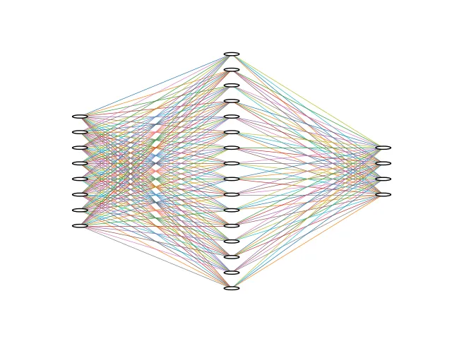
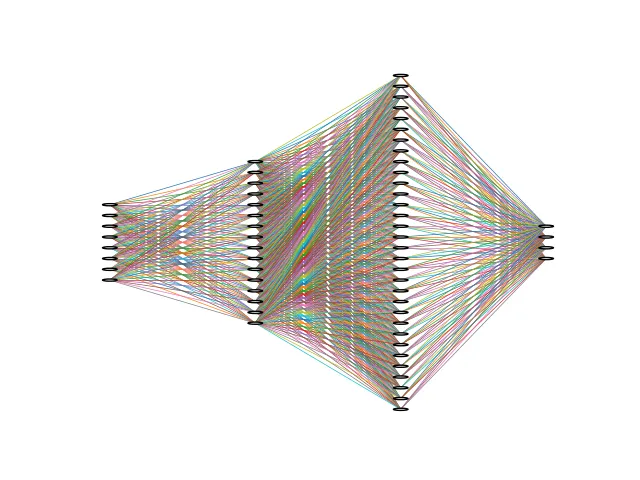

+++
date = '2025-08-17T08:10:00+03:30'
draft = false
title = 'Model'
description = "Model in Pytorch"
weight = 30
+++

# Model

# What is model

Model in PyTorch can be seen as a function that maps `inputs` to `outputs`.
It consists of different layers, each of which has its own requirements.
In our `hello world` example, we had a simple `linear` model that required its input to
have 8 features, and produced output of 4 features.

```python
# -------------------[ Model ]-------------------
model = nn.Linear(8, 4)  # (features, number_of_classes)
```


Now, let's make the model a little bit more complex.

# Sequential Model

One of the ways that we can stack up some layers in **PyTorch** is by using
`nn.Sequential`.
So, let's make our model a little bit more complicated, like below:

```python
model_2 = nn.Sequential(
    nn.Linear(8, 16),
    nn.Linear(16, 4),
)
```



As you can see, our model right now takes `8` features as its input.
Then, it maps it to `16`.
And finally, it produces `4` output.
As it's shown in the image above, we have some circles that lines are connected to.
We call these circles `neurons`.
The first layer is called an **input layer**.
The middle layer, which has `16` neurons called a **hidden layer**.
And the last layer is called an output layer.
So, for this model we have:

* 1 Input layer
* 1 Hidden layer
* 1 Output layer

Now, let's make some random data and see if it works correctly or not.

```python
data = torch.rand((3, 8))
result = model_2(data)

print(result)

"""
--------
output: 
tensor([[ 0.3901, -0.0124, -0.1982,  0.4792],
        [ 0.6230,  0.0920, -0.0491,  0.5871],
        [ 0.4019,  0.0620, -0.2312,  0.4669]], grad_fn=<AddmmBackward0>)
"""
```

As you could see, we have the output in a way that we wanted, and the model is functioning correctly.
Now, let's make 2 hidden layers.

```python
model_3 = nn.Sequential(
    nn.Linear(8, 16),
    nn.Linear(16, 32),
    nn.Linear(32, 4),
)
```



As you can see, we have 2 hidden layers now.
One with 16 neurons and the other with 32 neurons.
Let's test this model as well to see if it functions correctly.

```python
data = torch.rand((3, 8))
result = model_3(data)

print(result)

"""
--------
output: 
tensor([[-0.2115, -0.2278, -0.0586, -0.0266],
        [-0.1489, -0.0981,  0.0675, -0.0184],
        [-0.1330, -0.1383,  0.1055, -0.0529]], grad_fn=<AddmmBackward0>)
"""
```

As it's shown above, it is functioning correctly.

## Standard way to define a model

In **Pytorch**, we define our model by creating a subclass of `nn.Module`.
We put all the layers in the `__init__` function.
We also put the way that we want to process our data in `forward` function.
For example, we can define a model like below:

```python
class MyModel(nn.Module):
    def __init__(self):
        super().__init__()

        self.layers = nn.Sequential(
            nn.Linear(8, 16),
            nn.Linear(16, 32),
            nn.Linear(32, 4),
        )

    def forward(self, x):
        x = self.layers(x)
        return x

```

In the code above, we have defined a model like `model_3`.
We put the layers in `__init__` function and put the way that we want to process the input in `forward` function.
Let's create an instance of that model and print it.

```python
my_model = MyModel()

print(my_model)

"""
--------
output: 

MyModel(
  (layers): Sequential(
    (0): Linear(in_features=8, out_features=16, bias=True)
    (1): Linear(in_features=16, out_features=32, bias=True)
    (2): Linear(in_features=32, out_features=4, bias=True)
  )
)
"""
```

As you can see, it shows the layers that we have created.
So, let's create some random data and feed it to our model to see if it functions correctly.

```python
data = torch.rand((3, 8))

result = my_model(data)
print(result)

"""
--------
output: 
tensor([[ 0.1615, -0.0514,  0.0914, -0.1007],
        [ 0.1709, -0.0739,  0.1314, -0.2231],
        [ 0.0905, -0.0171,  0.1184, -0.1016]], grad_fn=<AddmmBackward0>)
"""
```

And as you can see, it functions as intended.
Now, let's see another example:

```python
class MyModel2(nn.Module):
    def __init__(self):
        super().__init__()

        self.layers_1 = nn.Sequential(
            nn.Linear(8, 16),
            nn.Linear(16, 32),
        )

        self.layers_2 = nn.Sequential(
            nn.Linear(32, 16),
            nn.Linear(16, 4),
        )

    def forward(self, x):
        x = self.layers_1(x)
        x = self.layers_2(x)
        return x
```

In this model, we have 2 sequential layers.
When we give data to this model, at first it goes through `layers_1` and then `layers_2`.
Let's create an instance of this model and print it.

```python
my_model_2 = MyModel2()

print(my_model_2)

"""
--------
output: 

MyModel2(
  (layers_1): Sequential(
    (0): Linear(in_features=8, out_features=16, bias=True)
    (1): Linear(in_features=16, out_features=32, bias=True)
  )
  (layers_2): Sequential(
    (0): Linear(in_features=32, out_features=16, bias=True)
    (1): Linear(in_features=16, out_features=4, bias=True)
  )
)
"""

```

Now let's test it to see if it functions correctly.

```python
data = torch.rand((3, 8))

result = my_model_2(data)
print(result)

"""
--------
output: 

tensor([[-0.2815,  0.2154,  0.0795, -0.0977],
        [-0.2823,  0.2451,  0.0843, -0.0942],
        [-0.2267,  0.2214,  0.0792, -0.0364]], grad_fn=<AddmmBackward0>)
"""
```

As you can see it works as it should be.

## Conclusion

In this tutorial we have learned how to define a model.
First, we learned how to make our layers more complex with `nn.Sequential`.
Then, we learned how to make a model in standard way with `nn.Module` and fill the `forward` function.
At this time, we only know about one layer, which is `Linear` layer.
Moving forward, we learn more about different layers and how to use them.
Also, you might say the outputs are pretty random.
In the next tutorials we are going to learn how to train our model.


