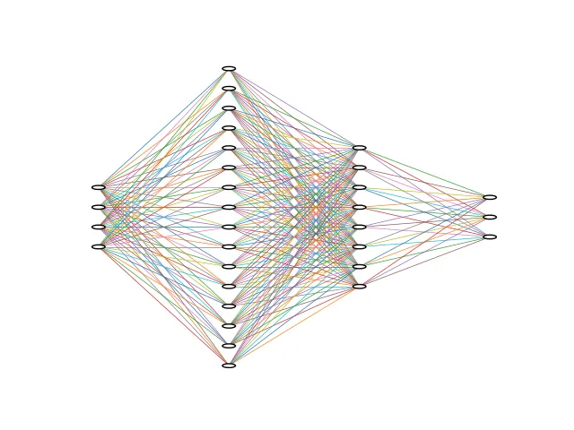

+++
date = '2025-08-17T11:12:00+03:30'
draft = false
title = 'Data'
description = "Data in Pytorch"
weight = 40
tags = ["PyTorch", "Deep-Learning", "Python"]
image = "data.webp"
+++

# Data

## Load a dataset

We can work with all kinds of data in **Pytorch**.
For this example, we are going to work with the data called
[IRIS](https://archive.ics.uci.edu/dataset/53/iris).
Let's load it together using a package called `scikit-learn`.
It is pre-installed on `Google Colab`, but if you want to install it,
you can use: `pip install scikit-learn`.

```python
from sklearn.datasets import load_iris

iris = load_iris()
```

After we run the code above, it downloads the dataset, and all the data are in
a variable called `iris`.
If we want to see what features it has, we can use the code below:

```python
print("feature names:")
print(iris.feature_names)

"""
--------
output: 

feature names:
['sepal length (cm)', 'sepal width (cm)', 'petal length (cm)', 'petal width (cm)']
"""


```

As you can see, it has `4` features:

* sepal length (cm)
* sepal width (cm)
* petal length (cm)
* petal width (cm)

If we want to see what the target classes are, we can use the code below:

```python
print("target names:")
print(iris.target_names)

"""
--------
output: 

target names:
['setosa' 'versicolor' 'virginica']
"""


```

As it is shown, it has `3` classes, which are the names of the flowers:

* setosa
* versicolor
* virginica

To access the data, we can use `iris.data`, and to access the targets of each sample,
we can use `iris.targets`.
Let's see how many samples we have:

```python
print("Number of samples:", len(iris.data))

"""
--------
output: 

Number of samples: 150
"""


```

As you can see, it has `150` samples.
Let's show some of the samples using the code below:

```python
chosen_indexes = np.linspace(0, len(iris.data), 10, dtype=int, endpoint=False)
print("Chosen indexes:")
print(chosen_indexes)
print()

print("10 sample of data:")
print(iris.data[chosen_indexes])
print()

print("10 sample of target:")
print(iris.target[chosen_indexes])
print()

"""
--------
output: 

Chosen indices:
[  0  15  30  45  60  75  90 105 120 135]

10 samples of data:
[[5.1 3.5 1.4 0.2]
 [5.7 4.4 1.5 0.4]
 [4.8 3.1 1.6 0.2]
 [4.8 3.  1.4 0.3]
 [5.  2.  3.5 1. ]
 [6.6 3.  4.4 1.4]
 [5.5 2.6 4.4 1.2]
 [7.6 3.  6.6 2.1]
 [6.9 3.2 5.7 2.3]
 [7.7 3.  6.1 2.3]]

10 samples of target:
[0 0 0 0 1 1 1 2 2 2]

"""
```

In the code above, I have chosen `10` samples of data using `np.linspace`.
After that, I printed the chosen indices.

Code of this tutorial is available at:
[link to the code](https://github.com/LiterallyTheOne/Pytorch_Tutorial/blob/main/src/3_data.ipynb)

## Make the data ready for the model

In our `hello world` example, we had `3` samples of data with `8` features.
Now, for this dataset, we have `150` samples of data with `4` features.
So, our job is pretty much the same; we should only transform our dataset and targets to `Tensors`.
To do so, we can use the code below:

```python
data = torch.tensor(iris.data).to(torch.float)
target = torch.tensor(iris.target)
```

Now, both the data and the target are in `Tensors`.
Also, I changed the type of data to `float`.
For the next step, let's prepare a model that can work with this data.

```python
class IRISClassifier(nn.Module):
    def __init__(self):
        super().__init__()

        self.layers = nn.Sequential(
            nn.Linear(4, 16),
            nn.Linear(16, 8),
            nn.Linear(8, 3),
        )

    def forward(self, x):
        return self.layers(x)
```



As you can see, I have created a model, called `IRISClassifier`, that has:

* 4 neurons for the input layer (because we have 4 input features)
* 16 neurons for the first hidden layer
* 8 neurons for the second hidden layer
* 3 neurons for the output layer (because we have to classify them into 3 classes)

So, let's create an instance of that model and print it.

```python
iris_classifier = IRISClassifier()
print(iris_classifier)

"""
--------
output: 

IRISClassifier(
  (layers): Sequential(
    (0): Linear(in_features=4, out_features=16, bias=True)
    (1): Linear(in_features=16, out_features=8, bias=True)
    (2): Linear(in_features=8, out_features=3, bias=True)
  )
)
"""
```

Then, let's feed the chosen indices of our data to it.

```python
logits = iris_classifier(data[chosen_indexes])
print(logits)

"""
--------
output: 

tensor([[ 0.7939, -0.1909,  0.1670],
        [ 0.8980, -0.1740,  0.1619],
        [ 0.7493, -0.1995,  0.1764],
        [ 0.7270, -0.2024,  0.1689],
        [ 0.7400, -0.2674,  0.1978],
        [ 0.9774, -0.2836,  0.1797],
        [ 0.8546, -0.2658,  0.2126],
        [ 1.1355, -0.3332,  0.1992],
        [ 1.0169, -0.2975,  0.2015],
        [ 1.1078, -0.3330,  0.1814]], grad_fn=<AddmmBackward0>)
"""
```

Now, we have an output.
Let's compare it with the targets that we have.

```python
predictions = logits.argmax(dim=1)
for prediction, true_label in zip(predictions, target[chosen_indexes]):
    print(prediction.item(), true_label.item())

"""
--------
output: 

0 0.0
0 0.0
0 0.0
0 0.0
0 1.0
0 1.0
0 1.0
0 2.0
0 2.0
0 2.0
"""
```

In the code above, at first, I used `argmax` as we used in the `Hello World` example.
Then, zipped the `predictions` and the chosen `targets` to iterate through them.
After that, I printed them beside each other to see how close my predictions
are to the true labels. (`.item` function returns the value of a single tensor)
As you can see, all the prediction classes are `0`.
The reason behind that is that we haven't trained our model yet.

## Dataset

The standard way of creating a **dataset** in **PyTorch** is by using
`torch.utils.data.Dataset`.
In this way, data is more manageable and can be dealt with in so many different ways.
Let's make a `Dataset` class for our `IRIS` dataset.

```python
class IRISDataset(Dataset):
    def __init__(self, data, target):
        super().__init__()
        self.data = data
        self.target = target

    def __len__(self):
        return len(self.data)

    def __getitem__(self, idx):
        data = torch.tensor(self.data[idx]).to(torch.float)
        target = torch.tensor(self.target[idx])
        return data, target
```

In the code above, we have a class that is an abstract of `Dataset`, called `IRISDataset`.
As you can see, we gave `data` and `target` as arguments to this class.
When we implement a `Dataset` in **PyTorch**, we have to implement `__len__` and `__getitem__` as well.
The function `__len__` returns the size of our data (`len(self.data)`).
Also, the function `__getitem__` returns each data and target with the given index.
We should make sure that we transform our data and target correctly before returning.
To do so, I transformed `data` to a `float Tensor` and `target` to a `Tensor`.
This function is used when we want to iterate over our dataset.
Let's load our data again and create an instance of our `IRISDataset`.

```python
iris = load_iris()

iris_dataset = IRISDataset(iris.data, iris.target)
```

Now, if we want to iterate over our dataset, we can use a simple for.
For example, in the code below, we iterate over our dataset and `break` the loop
after `one` element.

```python
for one_data, one_target in iris_dataset:
    print(one_data)
    print(one_target)
    break

"""
--------
output: 

tensor([5.1000, 3.5000, 1.4000, 0.2000])
tensor(0.)
"""
```

## DataLoader

In **PyTorch**, we have a class called `DataLoader`.
This class is super useful when you want to train your model.
It gives you so many options that you can control pretty easily.
Let's create a `DataLoader` for our `iris_dataset`.

```python
from torch.utils.data import DataLoader

iris_loader = DataLoader(iris_dataset, batch_size=10, shuffle=True)
```

In the code above, we created an instance of `DataLoader` and stored it in `iris_loader`.
We set the `batch_size` to `10`.
This means in each iteration, our `Dataloader`, returns `10` samples of data.
Also, we set `suffle` to true.
This argument shuffles the order of data every time, which is super useful in training.
Now, let's make a loop that iterates over `iris_loader`, and shows only the first element.

```python
for batch_of_data, batch_of_target in iris_loader:
    print(batch_of_data)
    print(batch_of_target)
    break

"""
--------
output: 

tensor([[6.4000, 2.9000, 4.3000, 1.3000],
        [6.4000, 3.1000, 5.5000, 1.8000],
        [7.7000, 2.6000, 6.9000, 2.3000],
        [4.8000, 3.4000, 1.9000, 0.2000],
        [4.6000, 3.2000, 1.4000, 0.2000],
        [6.7000, 3.1000, 4.4000, 1.4000],
        [6.2000, 2.8000, 4.8000, 1.8000],
        [6.1000, 3.0000, 4.6000, 1.4000],
        [5.7000, 2.8000, 4.1000, 1.3000],
        [5.4000, 3.9000, 1.3000, 0.4000]])
tensor([1., 2., 2., 0., 0., 1., 2., 1., 1., 0.])
"""
```

As you can see, there are 10 samples of `data` with their `target`.
If you run this loop multiple times, you will get different output every time.
The reason behind that is that we set the `suffle` to `True` in our data loader.

## Train, Validation, and Test data

When we want to train our model, it is recommended to have 3 sets of data:

* **Train**: The data that the model is trained on
* **Validation**: The data that the model doesn't train on, and it is being used to evaluate the model after each
  `epoch`
* **Test**: The completely unseen data to evaluate our model after the training is over.

There are so many different ways that we can split our data.
One of the ways is using `random_split` in `pytorch.utils.data`.
To do so, we can use the code below:

```python
from torch.utils.data import random_split

g1 = torch.Generator().manual_seed(20)
train_data, val_data, test_data = random_split(iris_dataset, [0.7, 0.2, 0.1], g1)
```

In the code above, at first, we create a `seed`.
This `seed`, makes sure that every time we use our code, we get the same `train`, `validation`, and `test` subsets
of our data.
Then we split our data using `random_split`.
As you can see, `70%` of the data goes for `training`, `20%` goes for `validation`, and `10%` goes for `testing`.
Now, let's print the size of each subset to see if it works correctly.

```python
print("train_data length:", len(train_data))
print("val_data length:", len(val_data))
print("test_data length:", len(test_data))

"""
--------
output: 
train_data length: 105
val_data length: 30
test_data length: 15
"""
```

As you can see, the data lengths are correct.
Now, let's create a `DataLoader` for each of them.

```python
train_loader = DataLoader(train_data, batch_size=10, shuffle=True)
val_loader = DataLoader(val_data, batch_size=10, shuffle=False)
test_loader = DataLoader(test_data, batch_size=10, shuffle=False)
```

As you can see, now we have 3 dataloaders for each subset.
Let's write a for loop to feed our training data to our model.

```python
for batch_of_data, batch_of_target in train_loader:
    logits = iris_classifier(batch_of_data)

    predictions = logits.argmax(dim=1)
    for prediction, true_label in zip(predictions, batch_of_target):
        print(prediction.item(), true_label.item())
    break

"""
--------
output: 

1 1.0
1 2.0
0 0.0
1 1.0
0 0.0
1 1.0
1 1.0
0 0.0
1 2.0
1 2.0
"""
```

In the code above, we have a for loop that iterates over the `train_loader`.
We feed each `batch_of_data` to our model to give us the `logits`.
Then, we compare our predictions with the true labels.
We put a `break` at the end of the for loop, to only show the first result.
Now, we have everything to train our model.

## Conclusion

In this tutorial, we have learned how to control data in **PyTorch**.
We downloaded a traditional dataset.
Then, we load that dataset as a `PyTorch Dataset`.
After that, we created a `DataLoader` for that `Dataset`.
Finally, we split our dataset into `train`, `validation`, and `test`.
Now, we are ready to train our model.
