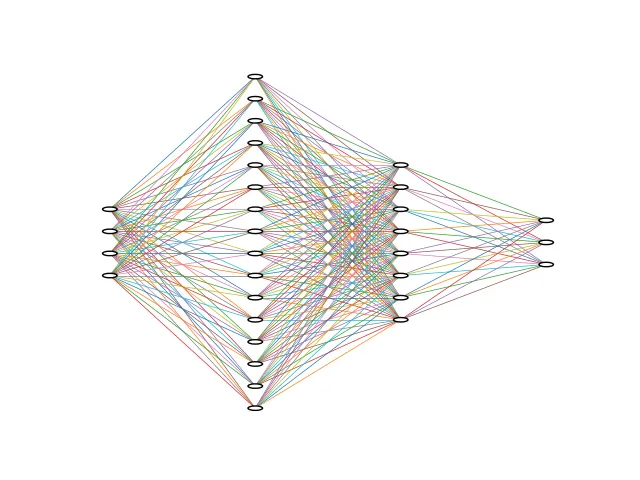

+++
date = '2025-08-17T11:12:00+03:30'
draft = false
title = 'Data'
description = "Data in Pytorch"
weight = 40
+++

# Data

# Load a dataset

We can work with all kinds of data in **Pytorch**.
For this example, we are going to work with the data called
[IRIS](https://archive.ics.uci.edu/dataset/53/iris).
Let's load it together using a package called `scikit-learn`.
It is pre-installed on `Google Colab`, but if you want to install it,
you can use: `pip install scikit-learn`.

```python
from sklearn.datasets import load_iris

iris = load_iris()
```

After we run the code above, it downloads the dataset, and all the data are in
a variable called `iris`.
If we want to see what features it has, we can use the code below:

```python
print("feature names:")
print(iris.feature_names)

"""
--------
output: 

feature names:
['sepal length (cm)', 'sepal width (cm)', 'petal length (cm)', 'petal width (cm)']
"""


```

As you can see, it has `4` features:

* sepal length (cm)
* sepal width (cm)
* petal length (cm)
* petal width (cm)

If we want to see what the target classes are, we can use the code below:

```python
print("target names:")
print(iris.target_names)

"""
--------
output: 

target names:
['setosa' 'versicolor' 'virginica']
"""


```

As it is shown, it has `3` classes, which are the names of the flowers:

* setosa
* versicolor
* virginica

To access the data, we can use `iris.data`, and to access the targets of each sample,
we can use `iris.targets`.
Let's see how many samples we have:

```python
print("Number of samples:", len(iris.data))

"""
--------
output: 

Number of samples: 150
"""


```

As you can see, it has `150` samples.
Let's show some of the samples using the code below:

```python
chosen_indexes = np.linspace(0, len(iris.data), 10, dtype=int, endpoint=False)
print("Chosen indexes:")
print(chosen_indexes)
print()

print("10 sample of data:")
print(iris.data[chosen_indexes])
print()

print("10 sample of target:")
print(iris.target[chosen_indexes])
print()

"""
--------
output: 

Chosen indices:
[  0  15  30  45  60  75  90 105 120 135]

10 samples of data:
[[5.1 3.5 1.4 0.2]
 [5.7 4.4 1.5 0.4]
 [4.8 3.1 1.6 0.2]
 [4.8 3.  1.4 0.3]
 [5.  2.  3.5 1. ]
 [6.6 3.  4.4 1.4]
 [5.5 2.6 4.4 1.2]
 [7.6 3.  6.6 2.1]
 [6.9 3.2 5.7 2.3]
 [7.7 3.  6.1 2.3]]

10 samples of target:
[0 0 0 0 1 1 1 2 2 2]

"""
```

In the code above, I have chosen `10` samples of data using `np.linspace`.
After that, I printed the chosen indices.

## Make the data ready for the model

In our `hello world` example, we had `3` samples of data with `8` features.
Now, for this dataset, we have `150` samples of data with `4` features.
So, our job is pretty much the same; we should only transform our dataset and targets to `Tensors`.
To do so, we can use the code below:

```python
data = torch.tensor(iris.data).to(torch.float)
target = torch.tensor(iris.target).to(torch.float)
```

Now, both the data and the target are in `Tensors` with the type of `float`.
For the next step, let's prepare a model that can work with this data.

```python
class IRISClassifier(nn.Module):
    def __init__(self):
        super().__init__()

        self.layers = nn.Sequential(
            nn.Linear(4, 16),
            nn.Linear(16, 8),
            nn.Linear(8, 3),
        )

    def forward(self, x):
        return self.layers(x)
```



As you can see, I have created a model, called `IRISClassifier`, that has:

* 4 neurons for the input layer (because we have 4 input features)
* 16 neurons for the first hidden layer
* 8 neurons for the second hidden layer
* 3 neurons for the output layer (because we have to classify them into 3 classes)

So, let's create an instance of that model and print it.

```python
iris_classifier = IRISClassifier()
print(iris_classifier)

"""
--------
output: 

IRISClassifier(
  (layers): Sequential(
    (0): Linear(in_features=4, out_features=16, bias=True)
    (1): Linear(in_features=16, out_features=8, bias=True)
    (2): Linear(in_features=8, out_features=3, bias=True)
  )
)
"""
```

Then, let's feed the chosen indices of our data to it.

```python
logits = iris_classifier(data[chosen_indexes])
print(logits)

"""
--------
output: 

tensor([[ 0.7939, -0.1909,  0.1670],
        [ 0.8980, -0.1740,  0.1619],
        [ 0.7493, -0.1995,  0.1764],
        [ 0.7270, -0.2024,  0.1689],
        [ 0.7400, -0.2674,  0.1978],
        [ 0.9774, -0.2836,  0.1797],
        [ 0.8546, -0.2658,  0.2126],
        [ 1.1355, -0.3332,  0.1992],
        [ 1.0169, -0.2975,  0.2015],
        [ 1.1078, -0.3330,  0.1814]], grad_fn=<AddmmBackward0>)
"""
```

Now, we have an output.
Let's compare it with the targets that we have.

```python
predictions = logits.argmax(dim=1)
for prediction, true_label in zip(predictions, target[chosen_indexes]):
    print(prediction.item(), true_label.item())

"""
--------
output: 

0 0.0
0 0.0
0 0.0
0 0.0
0 1.0
0 1.0
0 1.0
0 2.0
0 2.0
0 2.0
"""
```

In the code above, at first, I used `argmax` as we used in the `Hello World` example.
Then, zipped the `predictions` and the chosen `targets` to iterate through them.
After that, I printed them beside each other to see how close my predictions
are to the true labels. (`.item` function returns the value of a single tensor)
As you can see, all the prediction classes are `0`.
The reason behind that is that we haven't trained our model yet.


