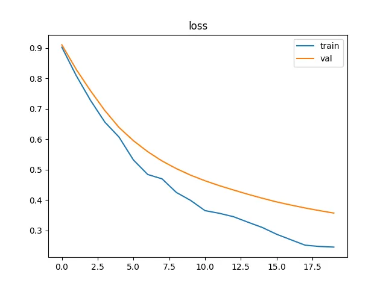
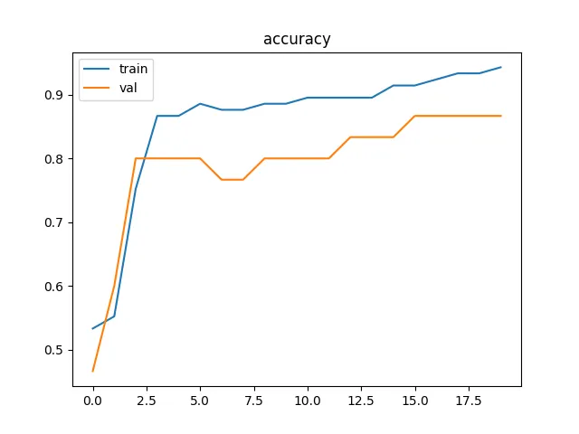

+++
date = '2025-08-27T11:28:00+03:30'
draft = false
title = 'Plot and TensorBoard'
description = "explaining how to plot our training and validation results also how to use tensorboard"
weight = 80
tags = ["PyTorch", "Deep-Learning", "Python", "TensorBaord", "matplotlib"]
image = "plot-tensorboard.webp"
+++

# Plot and TensorBoard

## Introduction

In the previous tutorials, we were just printing our training and evaluation results.
When our training epochs become larger or when we want to compare two methods with each other,
looking at the numbers becomes devastating.
One of the best ways to do that is to plot them.
In this tutorial, we are going to first plot the results using `matplotlib`,
then we will be using `TensorBoard` to achieve a better result.

## Plot using matplotlib

To plot our results using `matplotlib`,
the first thing that we should do is to make a list of our previous results in our training loop,
like below:

```python
train_losses = []
train_accuracies = []

val_losses = []
val_accuracies = []

for epoch in range(20):
    print("-" * 20)
    print(f"epoch: {epoch}")

    train_loss, train_accuracy = train_step(train_loader, model, optimizer, loss_fn, device)
    train_losses.append(train_loss)
    train_accuracies.append(train_accuracy)

    val_loss, val_accuracy = val_step(val_loader, model, loss_fn, device)
    val_losses.append(val_loss)
    val_accuracies.append(val_accuracy)

    print(f"train: ")
    print(f"\tloss: {train_loss:.4f}")
    print(f"\taccuracy: {train_accuracy:.4f}")

    print(f"validation: ")
    print(f"\tloss: {val_loss:.4f}")
    print(f"\taccuracy: {val_accuracy:.4f}")
```

In the code above, I have created 4 lists (`train_losses`, `train_accuracies`, `val_losses`, `val_accuracies`).
Each list is for a different result.
As you can see, I have increased the epoch range to `20` as well.
Now, let's plot our results.

```python
from matplotlib import pyplot as plt

# -------------------[ Plot our results ]-------------------
plt.figure()
plt.title("loss")
plt.plot(train_losses, label="train")
plt.plot(val_losses, label="val")
plt.legend()

plt.figure()
plt.title("accuracy")
plt.plot(train_accuracies, label="train")
plt.plot(val_accuracies, label="val")
plt.legend()

plt.show()
```

In the code above, I plot losses and accuracies in different figures.
I have put all the changed parts in
[train_plot.py](https://github.com/LiterallyTheOne/Pytorch_Tutorial/blob/main/src/7_plot_tensorboard/train_plot.py).
So, the output would be something like below:





As you can see, analyzing the plots is so much easier than examining the numbers.


