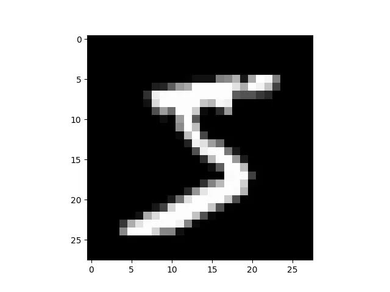
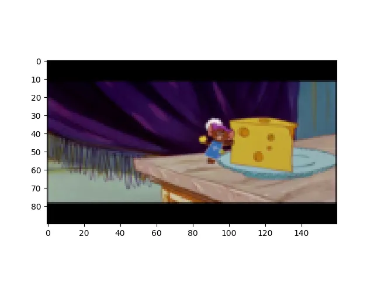

+++
date = '2025-08-28T08:45:00+03:30'
draft = false
title = 'Work with image'
description = "Explaining how to work with images in PyTorch"
weight = 90
tags = ["PyTorch", "TorchVision", "Deep-Learning", "Python", "matplotlib", "Kaggle"]
image = "work-with-image.webp"
+++

# Work with Images

## Introduction

In the previous tutorials, we have learned how to work with one-dimensional data.
In this tutorial, we are going to learn how to make a `dataloader` out of images.

Code of this tutorial is available at:
[link to the code](https://github.com/LiterallyTheOne/Pytorch_Tutorial/blob/main/src/8_work_with_image.ipynb)

## Load a dataset

`PyTorch` has a built-in way to download and load some important datasets.
This functionality is available with their `TorchVision` package.
Let's download a minimal `Dataset` called `MNIST`.
This dataset contains `0` to `9` handwritten numbers.
To do so, we can use the code below:

```python
from torchvision.datasets import MNIST

train_data = MNIST("data/", train=True, download=True)
test_data = MNIST("data/", train=False, download=True)
```

In the code above, we loaded `MNIST` in two subsets: `train` and `test`.
The first argument is the path of the data that we want to load.
In our case, we set that to `data/`.
With the `train` argument, we can control whether we want to download `train` subset
or `test` subset.
When we set `download` to `True`, if the `data` is not available in the given path,
it would download it.
These subsets are the instances of `Dataset`.
To make sure, we can check them with the code below:

```python
print(isinstance(train_data, Dataset))

"""
--------
output: 

True
"""
```

So, knowing this, we can do all the things with `Dataset` that we would do before.
Let's now see the size of each dataset.

```python
print(f"train_data's size: {len(train_data)}")
print(f"test_data's size: {len(test_data)}")

"""
--------
output: 

train_data's size: 60000
test_data's size: 10000
"""
```

As you can see, we have `60000` data for training and `10000` data for testing.
Now let's display one of the images.

```python
from matplotlib import pyplot as plt

for image, label in train_data:
    plt.imshow(image, cmap="gray")
    print(label)
    break

"""
--------
output: 

5
"""
```



In the code above, we have displayed one sample of `MNIST` with its label.

## Transforms

As you recall, in the previous tutorials, we had created a `Dataset` like below:

```python
class IRISDataset(Dataset):
    def __init__(self, data, target):
        super().__init__()
        self.data = data
        self.target = target

    def __len__(self):
        return len(self.data)

    def __getitem__(self, idx):
        data = torch.tensor(self.data[idx]).to(torch.float)
        target = torch.tensor(self.target[idx])
        return data, target
```

In the `__getitem__` function, we were transforming our `data` and `target` to tensors to make them ready for our
model.
In `PyTorch`, it is a good practice to implement two more arguments for our `Dataset` called:
`transform` and `target_transform`.
`transform` is being used for transforming each sample of data, and `target_transform` is being used for transforming
each target.
In the code above, we have:

* `transfrom`: `torch.tensor(self.data[idx]).to(torch.float)`
* `target_transform`: `torch.tensor(self.target[idx])`

If we want to change our dataset to have these two arguments, we can do something like below:

```python
class IRISDataset(Dataset):
    def __init__(self, data, target, transform=None, target_transform=None):
        super().__init__()
        self.data = data
        self.target = target

        if transform is None:
            transform = lambda x: torch.tensor(x).to(torch.float)

        if target_transform is None:
            target_transform = lambda x: torch.tensor(x)

        self.transform = transform
        self.target_transform = target_transform

    def __len__(self):
        return len(self.data)

    def __getitem__(self, idx):
        data = self.transform(self.data[idx])
        target = self.target_transform(self.target[idx])
        return data, target
```

As you can see, in the code above, we have defined `transform` and `target_transform` as arguments.
If they were `None`, we would have defined them as they were, using `lambda` function.
`TorchVision` has provided us with some built-in transforms for images.
You can find all the transforms in this link:
[TorchVision Transforms](https://docs.pytorch.org/vision/0.9/transforms.html)
At first, we are going to use the `ToTensor` transform.
This module transforms the `image` to `Tensor`.
So, when we want to load our `MNIST`, we are going to add that as a transform.

```python
from torchvision import transforms

train_data = MNIST("data/", train=True, download=True, transform=transforms.ToTensor())
test_data = MNIST("data/", train=False, download=True, transform=transforms.ToTensor())
```

Now, let's see if it's applied or not.

```python
for image, label in train_data:
    print(type(image))
    break

"""
--------
output: 

<class 'torch.Tensor'>
"""
```

As you can see, the type of our image is `Tensor`.

We can make a sequence of `transforms` using `transforms.Compose`.
For example, let's first resize each image to `[14, 14]` (our current size is `[28, 28]`).
Then, transform them into tensors.

```python
transform_compose = transforms.Compose(
    [
        transforms.Resize([14, 14]),
        transforms.ToTensor()
    ]
)
```

Now, let's test it to see if it works or not.

```python
# -------------------[ Before transform compose ]-------------------
for image, label in train_data:
    print(f"Before transform compose: {image.shape}")
    break

train_data = MNIST("data/", train=True, download=True, transform=transform_compose)
test_data = MNIST("data/", train=False, download=True, transform=transform_compose)

# -------------------[ After transform compose ]-------------------
for image, label in train_data:
    print(f"After transform compose: {image.shape}")
    break

"""
--------
output: 

Before transform compose: torch.Size([1, 28, 28])
After transform compose: torch.Size([1, 14, 14])
"""
```

As you can see in the code above, it works as intended.

## Train, validation, and test

We had `60000` data to train and `10000` data for testing.
Now, let's make a `validation subset` as well.
One of the ways to do that is to split `test subset` into two subsets.

```python
g1 = torch.Generator().manual_seed(20)
val_data, test_data = random_split(test_data, [0.7, 0.3], g1)

print(f"val_data's size: {len(val_data)}")
print(f"test_data's size: {len(test_data)}")

"""
--------
output: 
val_data's size: 7000
test_data's size: 3000

"""
```

In the code above, I have divided the `test_data` into `val_data` and `test_data`.
So, `70%` of the `10000` ($10000 \times 70% = 7000$) goes for validation, and the rest goes for testing.
Now, let's make data loaders from them.

```python
train_loader = DataLoader(train_data, batch_size=64, shuffle=True)
val_loader = DataLoader(val_data, batch_size=64, shuffle=False)
test_loader = DataLoader(test_data, batch_size=64, shuffle=False)
```

As you can see, we now have all 3 `dataloaders` which we needed to train our model.

## ImageFolder

One of the ways to load an image dataset is with `ImageFolder`.
`ImageFolder` requires your data to be in this structure:

* main_folder
    * class_1
        * image_1
        * image_2
        * ...
    * class_2
        * image_3
        * image_4
        * ...
    * ...

As you can see, each class has its own directory and all its data is in that directory.
Let's download a dataset from `Kaggle` with the name of `Tom and Jerry` in this link:
[Tom and Jerry](https://www.kaggle.com/datasets/balabaskar/tom-and-jerry-image-classification).
We can use the code below to do that:

```python
import kagglehub
from pathlib import Path

path = kagglehub.dataset_download("balabaskar/tom-and-jerry-image-classification")
path = Path(path) / "tom_and_jerry/tom_and_jerry"
```

In the code above, I have downloaded the dataset using `kagglehub`, also I changed the path to the correct
path to have the structure that we wanted.
Now, let's see what classes we have:

```python
for x in path.iterdir():
    print(x.name)

"""
--------
output: 

tom
jerry
tom_jerry_1
tom_jerry_0
"""
```

As you can see, we have four classes:

* `tom`: when only Tom is in the picture
* `jerry`: when only Jerry is in the picture
* `tom_jerry_1`: when both of them are on the picture
* `tom_jerry_0`: when none of them are on the picture

Let's load this dataset using `ImageFolder`.

```python
tom_and_jerry_transforms = transforms.Compose([transforms.Resize([90, 160]), transforms.ToTensor()])

all_data = ImageFolder(path, transform=tom_and_jerry_transforms)
```

In the code above, I have defined two transforms, one for resizing and one to transform each image into a tensor.
Then, I loaded the data using `ImageFolder`.
Now, let's display one of the images.

```python
for image, label in all_data:
    plt.figure()
    plt.imshow(transforms.ToPILImage()(image))
    print(label)
    break

"""
--------
output: 

0
"""
```



In the code above, I have displayed one image of our dataset.
Images are currently in tensor format.
To change them back to images, I used a transform called: `ToPILImage()`.
Now, let's split them and make dataloaders:

```python
g1 = torch.Generator().manual_seed(20)
train_data, val_data, test_data = random_split(all_data, [0.7, 0.2, 0.1], g1)

train_loader = DataLoader(train_data, batch_size=16, shuffle=True)
val_loader = DataLoader(val_data, batch_size=16, shuffle=False)
test_loader = DataLoader(test_data, batch_size=16, shuffle=False)
```

And here you have it, we have our 3 dataloaders that we can work with.

## Conclusion

In this tutorial, we have learned how to load and prepare image datasets.
First, we used the built-in modules in `TorchVision`.
Then, we explained `transforms` to prepare our dataset.
Finally, we have learned how to work with `ImageFolder`.