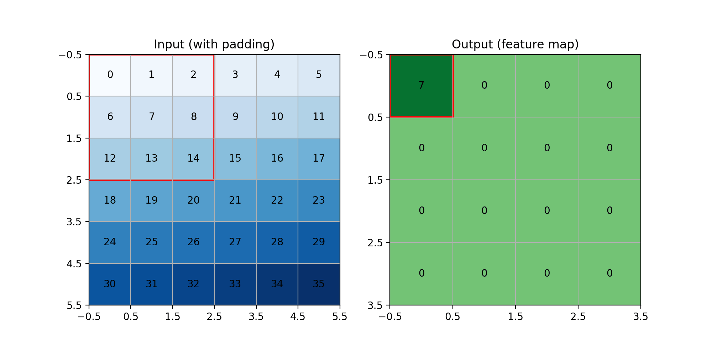
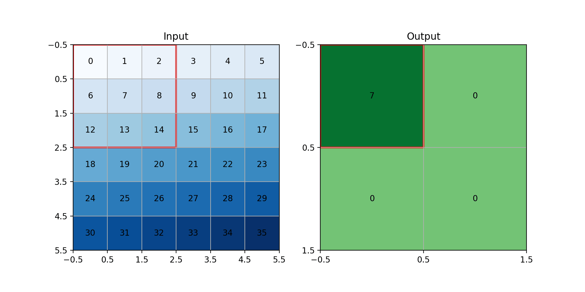
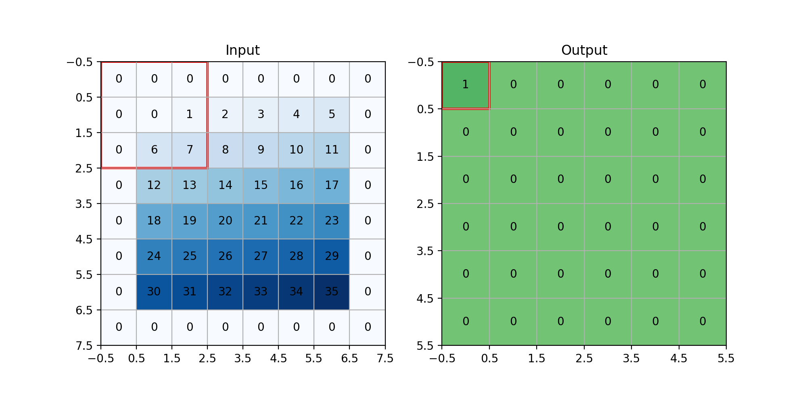

+++
date = '2025-08-30T08:00:00+03:30'
draft = false
title = 'Convolution and ReLU'
description = "Explaning about convolution and ReLU"
weight = 100
tags = ["PyTorch", "TorchVision", "Deep-Learning", "Python", "matplotlib"]
image = "convolution-and-relu.webp"
+++

# Convolution and ReLU

## Introduction

In the previous tutorial, we learned how to work with images.
We learned how to load an image dataset and how to transform its images into tensors.
In this tutorial, we are going to learn about a layer that is being widely used for images
in **Deep Learning** called **Convolution**.
Also, we are going to talk about `ReLU` and make you more familiar with how to work with any **layer**.

Code of this tutorial is available at:
[link to the code](https://github.com/LiterallyTheOne/Pytorch_Tutorial/blob/main/src/9_convolution_and_relu.ipynb)

## Convolution

Convolution is an operation in which we slide a smaller matrix (kernel) over a bigger matrix and calculate the
weighted sum.
Let's explain its concepts using an example.
In our example, we have a `6x6` image, and our kernel is `3x3`, like below:

```python
image_size = (6, 6)
kernel_size = (3, 3)

image = np.arange(image_size[0] * image_size[1]).reshape(image_size)
kernel = np.ones(kernel_size) / (kernel_size[0] * kernel_size[1])

print("image:")
print(image)
print("kernel:")
print(kernel)

"""
--------
output: 

image:
[[ 0  1  2  3  4  5]
 [ 6  7  8  9 10 11]
 [12 13 14 15 16 17]
 [18 19 20 21 22 23]
 [24 25 26 27 28 29]
 [30 31 32 33 34 35]]
kernel:
[[0.11111111 0.11111111 0.11111111]
 [0.11111111 0.11111111 0.11111111]
 [0.11111111 0.11111111 0.11111111]]
"""
```

As you can see, our image is the numbers from `0` to `35`, and our kernel is working as an average kernel.
If we apply convolution, we are going to have a result like below:



As you can see in the GIF above, the kernel is being slid on our image, and we are getting the average of each `3x3`
block as an output.
Let's calculate the first block.

$$
0 \times \frac{1}{9} +
1 \times \frac{1}{9} +
2 \times \frac{1}{9} +
6 \times \frac{1}{9} +
7 \times \frac{1}{9} +
8 \times \frac{1}{9} +
12 \times \frac{1}{9} +
13 \times \frac{1}{9} +
14 \times \frac{1}{9} =
7
$$

As you can see, the calculations have the same results as the code.
Also, our input's shape is `6x6`, but our output's shape is `4x4`.
The reason behind that is our kernel is `3x3`.
So, we can only slide it `4` times on our input.
For now, we can calculate it like below:

$$
W_{out}=(W_{in}-K_{w}) + 1
\\\\
H_{out}=(H_{in}-K_{h}) + 1
$$

* W: Width
* H: Height
* K: Kernel

Now, let's talk about 3 important things in **Convolution**.

### Stride

Right now, we are sliding our kernel `1` square at a time.
If we decide to slide it with a number different from one, we can use `stride`.



As you can see in the GIF above, we put the stride to `2`.
So, it slides `2` squares instead of `1` in both `x` and `y` axis.
As a result, our output's shape becomes half of what it was.
We can calculate the output's shape as below:

$$
W_{out}=\frac{(W_{in}-K_{w})}{S_{w}} + 1
\\\\
H_{out}=\frac{(H_{in}-K_{h})}{S_{h}} + 1
$$

* W: Width
* H: Height
* K: Kernel
* S: Stride

### padding

Padding is a technique that we use to fill the surrounding of the input with some values.
The most common value for padding is `0`, which is called `zero padding`.
The main reason for that is to prevent our image from being shrunk after some convolutions.
In the previous example, you saw that the image with `6x6` becomes `4x4`.
If the input shape and output shape are the same, it is called `zero-padding`.



As you can see in the GIF above, we have added zeros to the surroundings of
our input.
As a result, our output has the same shape as our input (`6x6`).
We can calculate the output size as below:

$$
W_{out}=\frac{(W_{in}+2P_w-K_w)}{S_w} + 1
\\\\
H_{out}=\frac{(H_{in}+2P_h-K_h)}{S_h} + 1
$$

* W: Width
* H: Height
* K: Kernel
* S: Stride
* P: Padding


## Load MNIST

At first, let's load **MNIST** again like we did in the previous tutorial.

```python
train_data = MNIST("data/", train=True, download=True, transform=transforms.ToTensor())
test_data = MNIST("data/", train=False, download=True, transform=transforms.ToTensor())
```

Now let's make `train`, `validation`, and `test` data loaders and see the shape of a batch of our data.

```python
g1 = torch.Generator().manual_seed(20)
val_data, test_data = random_split(test_data, [0.7, 0.3], g1)

train_loader = DataLoader(train_data, batch_size=64, shuffle=True)
val_loader = DataLoader(val_data, batch_size=64, shuffle=False)
test_loader = DataLoader(test_data, batch_size=64, shuffle=False)

images, labels = next(iter(train_loader))

print(f"images shape : {images.shape}")
print(f"labels shape : {labels.shape}")

"""
--------
output: 

images shape : torch.Size([64, 1, 28, 28])
labels shape : torch.Size([64])
"""
```

As you can see, we have a batch of our data with a batch size of `64`.
Each image is grayscale, so it has `1` channel, and the size of the image is `28x28`.

## Convolution layer

Convolution is an operation in which we slide a smaller matrix (kernel) over a bigger matrix and calculate the
weighted sum.

We can define a `Convolution layer` in **PyTorch** like below:

```python
conv_1 = nn.Conv2d(
    in_channels=1,
    out_channels=3,
    kernel_size=3,
)
```

In the code above, we have defined a `convolution layer`.
This layer takes `1` channel as its input (because our data has `1` channel).
For its output, it creates `3` channels.
Also, it has a `3x3` kernel.

Before we run our `convolution layer` on real data, let's explain how it works in an example where its shape is `6x6`.
