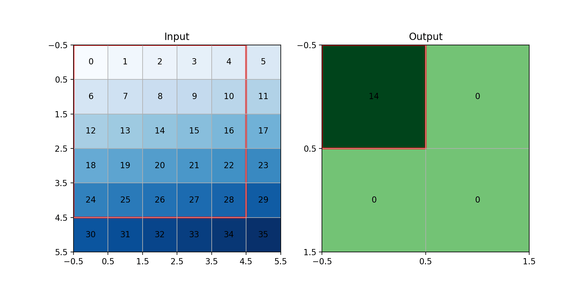

+++
date = '2025-08-30T08:00:00+03:30'
draft = false
title = 'Convolution and ReLU'
description = "Explaning about convolution and ReLU"
weight = 100
tags = ["PyTorch", "TorchVision", "Deep-Learning", "Python", "matplotlib"]
image = "convolution-and-relu.webp"
code = "https://github.com/LiterallyTheOne/Pytorch_Tutorial/blob/main/src/9_convolution_and_relu"
+++

# Convolution and ReLU

## Introduction

In the previous tutorial, we learned how to work with images.
We learned how to load an image dataset and how to transform its images into tensors.
In this tutorial, we are going to learn about a layer that is being widely used for images
in **Deep Learning** called **Convolution**.
Also, we are going to talk about `ReLU` and make you more familiar with how to work with any **layer**.

## Convolution

Convolution is an operation in which we slide a smaller matrix (kernel) over a bigger matrix and calculate the
weighted sum.
Let's explain its concepts using an example.
In our example, we have a `6x6` image, and our kernel is `3x3`, like below:

```python
image_size = (6, 6)
kernel_size = (3, 3)

image = np.arange(image_size[0] * image_size[1]).reshape(image_size)
kernel = np.ones(kernel_size) / (kernel_size[0] * kernel_size[1])

print("image:")
print(image)
print("kernel:")
print(kernel)

"""
--------
output: 

image:
[[ 0  1  2  3  4  5]
 [ 6  7  8  9 10 11]
 [12 13 14 15 16 17]
 [18 19 20 21 22 23]
 [24 25 26 27 28 29]
 [30 31 32 33 34 35]]
kernel:
[[0.11111111 0.11111111 0.11111111]
 [0.11111111 0.11111111 0.11111111]
 [0.11111111 0.11111111 0.11111111]]
"""
```

As you can see, our image is the numbers from `0` to `35`, and our kernel is working as an average kernel.
If we apply convolution, we are going to have a result like below:


As you can see in the GIF above, the kernel is being slid on our image, and we are getting the average of each `3x3`
block as an output.
Let's calculate the first block.

$$
0 \times \frac{1}{9} +
1 \times \frac{1}{9} +
2 \times \frac{1}{9} +
6 \times \frac{1}{9} +
7 \times \frac{1}{9} +
8 \times \frac{1}{9} +
12 \times \frac{1}{9} +
13 \times \frac{1}{9} +
14 \times \frac{1}{9} =
7
$$

As you can see, the calculations have the same results as the code.
Also, our input's shape is `6x6`, but our output's shape is `4x4`.
The reason behind that is our kernel is `3x3`.
So, we can only slide it `4` times on our input.
For now, we can calculate it like below:

$$
W_{out}=(W_{in}-K_{w}) + 1
\\\\
H_{out}=(H_{in}-K_{h}) + 1
$$

* W: Width
* H: Height
* K: Kernel

Now, let's talk about 3 important things in **Convolution**.
If you want to experience different convolutions with different options,
you can use this code:
[conv_gif.py](https://github.com/LiterallyTheOne/Pytorch_Tutorial/blob/main/helpers/conv_gif.py).

### Stride

Right now, we are sliding our kernel `1` square at a time.
If we decide to slide it with a number different from one, we can use `stride`.


As you can see in the GIF above, we put the stride to `2`.
So, it slides `2` squares instead of `1` in both `x` and `y` axis.
As a result, our output's shape becomes half of what it was.
We can calculate the output's shape as below:

$$
W_{out}=\frac{(W_{in}-K_{w})}{S_{w}} + 1
\\\\
H_{out}=\frac{(H_{in}-K_{h})}{S_{h}} + 1
$$

* W: Width
* H: Height
* K: Kernel
* S: Stride

### padding

Padding is a technique that we use to fill the surrounding of the input with some values.
The most common value for padding is `0`, which is called `zero padding`.
The main reason for that is to prevent our image from being shrunk after some convolutions.
In the previous example, you saw that the image with `6x6` becomes `4x4`.
If the input shape and output shape are the same, it is called `zero-padding`.


As you can see in the GIF above, we have added zeros to the surroundings of
our input.
As a result, our output has the same shape as our input (`6x6`).
We can calculate the output size as below:

$$
W_{out}=\frac{(W_{in}+2P_w-K_w)}{S_w} + 1
\\\\
H_{out}=\frac{(H_{in}+2P_h-K_h)}{S_h} + 1
$$

* W: Width
* H: Height
* K: Kernel
* S: Stride
* P: Padding

### Dilation

Dilation is a technique that we use to make the kernel bigger to cover a bigger area.
To do so, we insert gaps between our kernel.
For example, if our kernel is like below:

$$
\begin{bmatrix}
1 & 2 & 3 \\
4 & 5 & 6 \\
7 & 8 & 9 \\
\end{bmatrix}
$$

After `dilation=2`, it becomes like below:

$$
\begin{bmatrix}
1 & 0 & 2 & 0 & 3 \\
0 & 0 & 0 & 0 & 0 \\
4 & 0 & 5 & 0 & 6 \\
0 & 0 & 0 & 0 & 0 \\
7 & 0 & 8 & 0 & 9 \\
\end{bmatrix}
$$



As you can see in the GIF above, we have `dilation=2`, so our kernel becomes `5x5`.
We can calculate the output shape with the formula below:

$$
W_{out}=\frac{(W_{in}+2P_w - D_w \times (K_w - 1) -1)}{S_w} + 1
\\\\
H_{out}=\frac{(H_{in}+2P_h - D_h \times (K_h - 1) -1)}{S_h} + 1
$$

* W: Width
* H: Height
* K: Kernel
* S: Stride
* P: Padding
* D: Dilation

## Load MNIST

Now, let's load **MNIST** again like we did in the previous tutorial.

```python
train_data = MNIST("data/", train=True, download=True, transform=transforms.ToTensor())
test_data = MNIST("data/", train=False, download=True, transform=transforms.ToTensor())
```

Now let's make `train`, `validation`, and `test` data loaders and see the shape of a batch of our data.

```python
g1 = torch.Generator().manual_seed(20)
val_data, test_data = random_split(test_data, [0.7, 0.3], g1)

train_loader = DataLoader(train_data, batch_size=64, shuffle=True)
val_loader = DataLoader(val_data, batch_size=64, shuffle=False)
test_loader = DataLoader(test_data, batch_size=64, shuffle=False)

images, labels = next(iter(train_loader))

print(f"images shape : {images.shape}")
print(f"labels shape : {labels.shape}")

"""
--------
output: 

images shape : torch.Size([64, 1, 28, 28])
labels shape : torch.Size([64])
"""
```

As you can see, we have a batch of our data with a batch size of `64`.
Each image is grayscale, so it has `1` channel, and the size of the image is `28x28`.

## Convolution layer

Earlier, we learned how `convolution` works.
Now, let's talk about how to use it in **PyTorch**.
We can define a `Convolution layer` in **PyTorch** like below:

```python
conv_1 = nn.Conv2d(
    in_channels=1,
    out_channels=3,
    kernel_size=3,
    stride=1,
    padding=1,
    dilation=1,
)
```

In the code above, we have defined a `convolution layer`.
This layer takes `1` channel as its input (because our data has `1` channel).
For its output, it creates `3` channels.
Also, it has a `3x3` kernel.
As you can see, we have control over `stride`, `padding`, and `dilation`.
Now, let's feed our loaded images to `conv_1`, to see what happens.

```python
result = conv_1(images)
print(f"input shape : {images.shape}")
print(f"output shape : {result.shape}")

"""
--------
output: 
input shape : torch.Size([64, 1, 28, 28])
output shape : torch.Size([64, 3, 28, 28])

"""
```

The results above show that the width and height of our inputs and outputs are the same.
The reason behind that is that we put `padding` to `1`.
Also, we have 3 channels for the results as expected.

## ReLU

`ReLU` stands for `Rectified Linear Unit`.
It is one of the most used activation functions in **Deep Learning**.
The logic behind that is pretty simple.
It only changes the negative values to `0`.
Here is its formula:

$$
ReLU(x) = max(0, x)
$$

We can define `ReLU` in **PyTorch** as below:

```python
relu = nn.ReLU()
```

Now let's test it to see how it works:

```python
a1 = torch.arange(-5, 6)
result = relu(a1)

print(f"input: {a1}")
print(f"output: {result}")

"""
--------
output: 

input: tensor([-5, -4, -3, -2, -1,  0,  1,  2,  3,  4,  5])
output: tensor([0, 0, 0, 0, 0, 0, 1, 2, 3, 4, 5])
"""
```

In the code above, we have created a tensor called `a1` which has values in the range of `[-5, 5]`.
We fed `a1` to `relu` and as a result, all the negative values have become zeros.

## Flatten

`Flatten` is a layer that we use to change the multidimensional input to one dimension.
It is pretty useful when we want to change the dimension of the output of our **convolution layers** to one dimension
and feed it to our **linear layers** in order to classify them.
We can define a `Flatten` layer in **PyTorch** like below:

```python
flatten = nn.Flatten()
```

Now, let's test it to see if it works as intended.

```python
a2 = torch.arange(0, 16).reshape((2, 2, 4)).unsqueeze(0)
result = flatten(a2)

print(f"input: {a2}")
print(f"input shape : {a2.shape}")
print(f"output: {result}")
print(f"output shape : {result.shape}")

"""
--------
output: 

input: tensor([[[[ 0,  1,  2,  3],
          [ 4,  5,  6,  7]],

         [[ 8,  9, 10, 11],
          [12, 13, 14, 15]]]])
input shape: torch.Size([1, 2, 2, 4])
output: tensor([[ 0,  1,  2,  3,  4,  5,  6,  7,  8,  9, 10, 11, 12, 13, 14, 15]])
output shape: torch.Size([1, 16])
"""
```

In the code above, we have defined an input called `a2` with the shape of `2x2x4`.
The values in `a2` are in range of `[0, 16]`.
Then we used `unsqueeze(0)` to add a dimension to the start of the tensor.
We did that because each layer in **PyTorch** requires a batch of data, not a single data by itself.
Then we fed that data to the `flatten` layer.
As a result, we can see the input shape has changed from `2x2x4` to `16`.
Also, all the data is untouched.

## Make a convolution model

Now that we know how convolution works and know how to connect convolution with a linear model for classification,
let's make a convolution model to classify the MNIST dataset.

```python
# -------------------[ Define Model ]-------------------
class IRISClassifier(nn.Module):
    def __init__(self):
        super().__init__()

        self.conv_layers = nn.Sequential(
            nn.Conv2d(in_channels=1, out_channels=32, kernel_size=3, padding=1, stride=2),  # 32x14x14
            nn.ReLU(),
            nn.Conv2d(in_channels=32, out_channels=64, kernel_size=3, padding=1, stride=2),  # 64x7x7
            nn.ReLU(),
            nn.Conv2d(in_channels=64, out_channels=128, kernel_size=3, padding=1, stride=3),  # 128x3x3
            nn.ReLU(),
        )

        self.classification_layers = nn.Sequential(
            nn.Flatten(),
            nn.Linear(128 * 3 * 3, 128),
            nn.ReLU(),
            nn.Linear(128, 10),
        )

    def forward(self, x):
        x = self.conv_layers(x)
        x = self.classification_layers(x)
        return x
```

In the code above, we have 2 parts for our model.
The first part consists of **Convolution layers** (`conv_layers`),
and the other part has **Classification layers** (`classification_layers`).
When we feed data to this model, it first goes through `conv_layers`, then it goes through `classification_layer`.
For `conv_layers`, we have `3` **Convolution layers**.
The first one takes the data with `1` channel and creates `32` channels as its output.
Its kernel size is `3` with padding `1` and a stride of `2`, so we can calculate its output shape as below:

$$
W_{out}=\frac{(W_{in}+2P_w-K_w)}{S_w} + 1
\rightarrow \frac{(28+2 \times 1 - 3)}{2}+1=13+1
\rightarrow \boxed{W_{out}=14}
\\\\
H_{out}=\frac{(H_{in}+2P_h-K_h)}{S_h} + 1
\rightarrow \frac{(28+2 \times 1 - 3)}{2}+1=13+1
\rightarrow \boxed{H_{out}=14}
$$

For the second convolution, we take $32$ channels and make $64$ channels.
Kernel size is $3$, padding is $1$, and stride is $2$.
So, we can calculate the output shape as below:

$$
W_{out}=\frac{(W_{in}+2P_w-K_w)}{S_w} + 1
\rightarrow \frac{(14 + 2 \times 1 - 3)}{2}+1=6+1
\rightarrow \boxed{W_{out}=7}
\\\\
H_{out}=\frac{(H_{in}+2P_h-K_h)}{S_h} + 1
\rightarrow \frac{(14 + 2 \times 1 - 3)}{2}+1=6+1
\rightarrow \boxed{H_{out}=7}
$$

And the third convolution has `64` input channels and makes `128` output channels.
Its kernel size is `3`, its padding is `1`, and its stride is `3`.
So, let's calculate the output shape of this convolution to:

$$
W_{out}=\frac{(W_{in}+2P_w-K_w)}{S_w} + 1
\rightarrow \frac{(7 + 2 \times 1 - 3)}{3}+1=2+1
\rightarrow \boxed{W_{out}=3}
\\\\
H_{out}=\frac{(H_{in}+2P_h-K_h)}{S_h} + 1
\rightarrow \frac{(7 + 2 \times 1 - 3)}{3}+1=2+1
\rightarrow \boxed{H_{out}=3}
$$

Our classification layer has 2 **linear layers**.
At first, we flatten the output of our `conv_layers`.
The output was in the shape of $128 \times 3 \times 3$, so the flatten of that would be the multiplication of them.
First, **linear layer** takes the $128 \times 3 \times 3$ and makes an output with $128$ neurons.
And the last **linear layer** takes $128$ as its input shape and outputs the $10$ class that we have for **MNIST**.
Now, let's give a batch of **MNIST** images to see if it works or not:

```python
model = IRISClassifier()
model(images)

"""
--------
output: 

tensor([[-0.0223,  0.0049, -0.0598, -0.0597, -0.0689, -0.0711,  0.0565, -0.0623,
          0.0433,  0.0466],
        [-0.0215,  0.0064, -0.0591, -0.0567, -0.0690, -0.0680,  0.0531, -0.0552,
          0.0441,  0.0499],
          ...
        [-0.0225,  0.0070, -0.0598, -0.0565, -0.0709, -0.0740,  0.0536, -0.0624,
          0.0413,  0.0421]], grad_fn=<AddmmBackward0>)
"""

```

As you can see, our model predicts $10$ classes for each image, which is the thing that we wanted.

## Train the model

Now, let's change the last code
([train_tensorboard.py](https://github.com/LiterallyTheOne/Pytorch_Tutorial/blob/main/src/7_plot_tensorboard/train_tensorboard.py))
And change the data to **MNIST** and change the model to our new **convolution model**.
I have already done that, and the changes are in
[train_mnist_conv.py](https://github.com/LiterallyTheOne/Pytorch_Tutorial/blob/main/src/9_convolution_relu/train_mnist_conv.py).
So let's run it for $5$ epochs and see the output.

```python

"""
--------
output: 

mps
--------------------
epoch: 0
train: 
	loss: 0.2567
	accuracy: 0.9219
validation: 
	loss: 0.0748
	accuracy: 0.9757
--------------------
epoch: 1
train: 
	loss: 0.0736
	accuracy: 0.9773
validation: 
	loss: 0.0575
	accuracy: 0.9816
--------------------
epoch: 2
train: 
	loss: 0.0501
	accuracy: 0.9843
validation: 
	loss: 0.0592
	accuracy: 0.9813
--------------------
epoch: 3
train: 
	loss: 0.0363
	accuracy: 0.9887
validation: 
	loss: 0.0389
	accuracy: 0.9859
--------------------
epoch: 4
train: 
	loss: 0.0289
	accuracy: 0.9912
validation: 
	loss: 0.0409
	accuracy: 0.9854
--------------------
test: 
	loss: 0.0465
	accuracy: 0.9863

"""
```

As you can see, we have reached a pretty good accuracy, and our loss is pretty low.

## Conclusion

In this tutorial, we learned how **Convolution** works and how we can use it for image datasets.
First, we explained the methodology of **Convolution**.
Then, we showed how we can use **Convolution**, **ReLU**, and **Flatten** in **PyTorch**.
After that, we made a model and calculated the output of each **Convolution layer**.
Finally, we trained our model and saw the output.