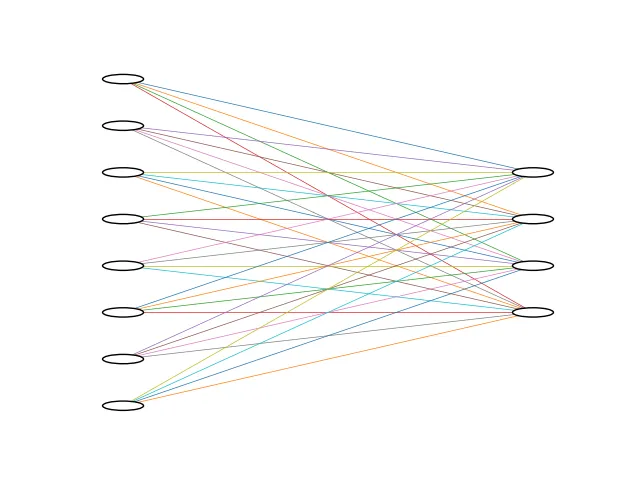

<style scoped>
p {
  color: cyan;
}
</style>

<!-- _header: "" -->
<!-- _footer: "" -->

# PyTorch Tutorial

By LiterallyTheOne

## 0: Introduction


---
<!-- paginate: true -->

## What is PyTorch?

- Machine Learning
- Open Source
- FaceBook AI (Meta AI)
- Mosly used for Deep Learning

---

## Why PyTorch is Popular?

- Flexibility
- Pythonic Interface

---

## Where is used?

- Researches
- Applications
- Generative AI

---

## In this Tutorial

- Start with a **Hello World** example
- Explain the needed concepts
- Complete our **Hello World**

---

## Requirements

- Be familiar with Python's basics
- Have PyTorch, Python installed
- Use **Google Colab**

---

## Hello world (problem defination)

- 3 samples of data
- 8 features
- 4 classes

---

## Fully Connected



---

## Implementation

```python
# -------------------[ Imports ]-------------------
import torch
from torch import nn
```

---

## Data

```python
# -------------------[ Data ]-------------------
data = torch.rand((3, 8))  # (number_of_samples, features)
```

---

## Model

```python
# -------------------[ Model ]-------------------
model = nn.Linear(8, 4)  # (features, number_of_classes)
```

---

## Feed the data to the model

```python
# -------------------[ Feed the data to the model ]-------------------
logits = model(data)
print(logits)

"""
--------
output: 

tensor([[ 5.3127e-01,  6.7324e-01, -1.7548e-01, -2.0279e-02],
       [ 5.3984e-01,  1.0462e+00, -1.0124e-01,  8.4969e-03],
       [ 4.6493e-01,  1.0864e+00, -3.6424e-01,  8.6406e-04]],
      grad_fn=<AddmmBackward0>)
"""
```

---

## Classify

```python
result = logits.argmax(1)
print(result)

"""
--------
output: 

tensor([1, 1, 1])
"""
```

---

## Link to the Post and materials


